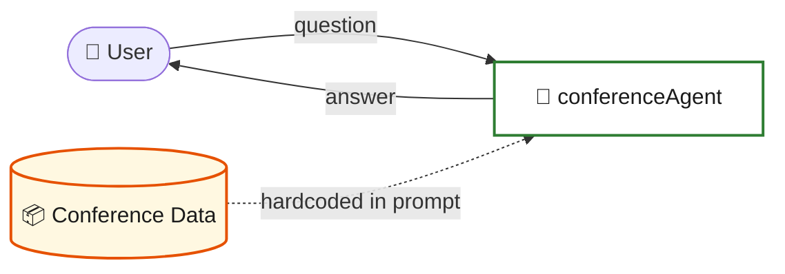
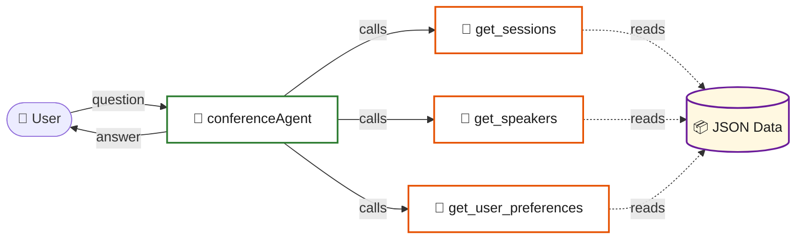
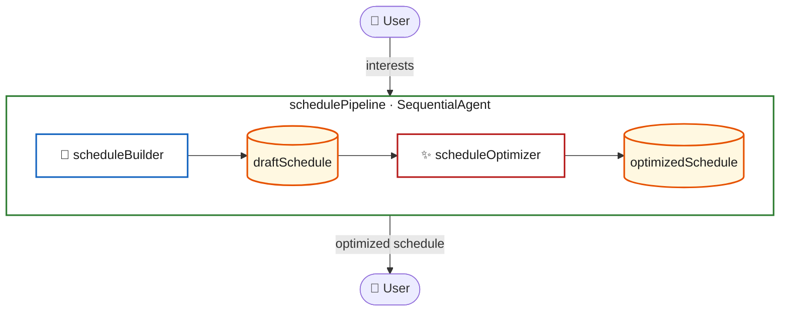
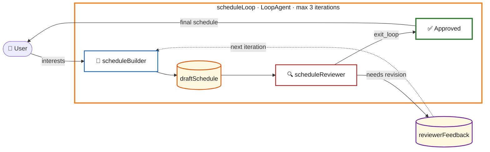
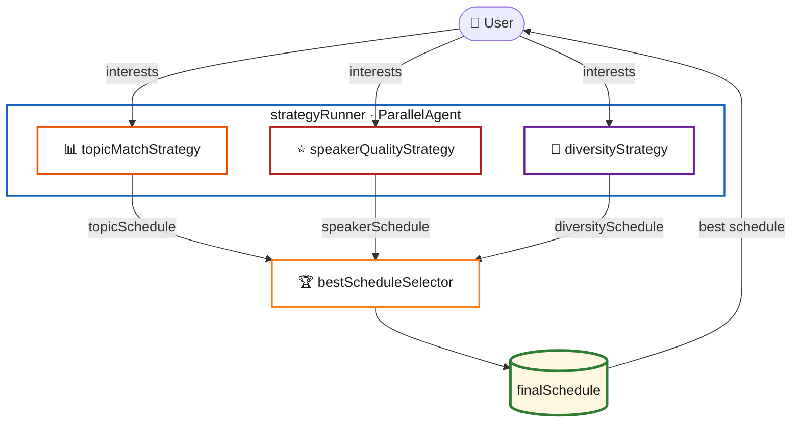

# 🛠️ Workshop Guide: Build a Conference Schedule Agent

Welcome to the ADK-JS workshop! 🎉 You'll build a Conference Schedule Agent for **DevFest Pisa 2026** — step by step, from a simple chatbot to a multi-agent system with parallel execution. 🚀

## 🗺️ Overview

```
Step 1: LlmAgent          -> Simple agent with hardcoded schedule
Step 2: FunctionTool       -> Extract data into tools
Step 3: SequentialAgent    -> Two-agent refinement pipeline
Step 4: LoopAgent          -> Iterative self-improvement with a critic
Step 5: ParallelAgent      -> Multi-strategy generation + selector
```

## 📁 Project Structure

Each step lives in its own folder under `src/`. You work through them in order, and each folder is self-contained:

```
src/
  01-intro/          -> Step 1
  02-tools/          -> Step 2
  03-sequential/     -> Step 3
  04-loop/           -> Step 4
  05-parallel/       -> Step 5
```

The `main` branch contains the starter code with TODOs for you to complete. The `final` branch contains the full solutions for reference. 💡

## ✅ Prerequisites

Make sure you've completed the setup from the [README](README.md):

- 📦 Node.js 24+, npm 10+, Git
- 🔑 Google AI API Key ([get one here](https://aistudio.google.com/apikey))
- 🧪 Run `./scripts/check-setup.sh` to verify

### 📥 Install dependencies

```bash
npm install
```

---

## 🧩 Step 1: Your First Agent

**Concept:** `LlmAgent` — the building block of ADK

**Folder:** `src/01-intro/`

### 🏗️ What you'll build



> A single `LlmAgent` with all conference data embedded directly in the system prompt. No tools, no composition — just one agent answering questions. 💬

### 🎓 What you'll learn

An `LlmAgent` wraps a large language model with a name, description, and instruction (system prompt). The instruction defines the agent's personality and knowledge. In this step, we use shared markdown utilities to inject the conference data into the agent's prompt.

The project includes a `src/common/` folder with reusable modules:

- **`conferenceData.ts`** — loads and validates conference, speakers, and schedule data from JSON files using Zod schemas
- **`toMarkdown.ts`** — converts each data type into well-structured markdown, ideal for LLM consumption

### ✏️ Your task

Open `src/01-intro/agent.ts` and complete the TODOs:

1. Import `{ conference, speakers, schedule }` from `"../common/conferenceData.js"`
2. Import `{ conferenceToMarkdown, speakersToMarkdown, scheduleToMarkdown }` from `"../common/toMarkdown.js"`
3. Use these functions inside a template literal to build the agent's `instruction`
4. Add a section describing how the agent should help attendees

**Key code:** 👇

```typescript
import { LlmAgent } from "@google/adk";
import { conference, speakers, schedule } from "../common/conferenceData.js";
import {
  conferenceToMarkdown,
  speakersToMarkdown,
  scheduleToMarkdown,
} from "../common/toMarkdown.js";
import { getModel } from "../common/models.js";

export const rootAgent = new LlmAgent({
  name: "conferenceAgent",
  model: getModel(),
  description: "A helpful assistant for DevFest Pisa 2026",
  instruction: `You are a friendly and enthusiastic conference assistant...

// Inject conference data as markdown here

## How you help attendees

- Answer questions about sessions, speakers, rooms, and timing
- Help attendees plan their day based on their interests
- Provide speaker bios and talk descriptions
- Give directions to the venue`,
});
```

### 🚀 Try it

```bash
npm run dev:01
```

This launches the ADK DevTools web UI. Open your browser and try:

- _"What AI sessions are available?"_ 🤖
- _"Tell me about Dr. Elena Rossi"_ 🎤
- _"Plan my day — I love Cloud and DevOps, intermediate level"_ 📅

### 🔍 Check the solution

Switch to the `final` branch and look at `src/01-intro/agent.ts`.

### 💭 Reflection

The agent works and the data stays in sync with the JSON source files automatically. However, all the data is still loaded into the prompt at once. What if you want the agent to look up data on demand? This motivates **Step 2**. ➡️

---

## 🔧 Step 2: Adding Tools

**Concept:** `FunctionTool` — give your agent superpowers 💪

**Folder:** `src/02-tools/`

### 🏗️ What you'll build



> The same agent, but now it fetches data on demand through **FunctionTools** instead of having everything in the prompt. The LLM decides which tools to call based on the user's question. 🧠

### 🎓 What you'll learn

Tools are functions that the LLM can call to retrieve data or perform actions. Instead of stuffing everything in the prompt, we define tools with typed parameters (using Zod schemas) and let the agent decide when to call them.

### ✏️ Your task

You'll find three files to work on:

**1. `src/02-tools/data/conferenceData.ts`** — Already provided! Contains typed arrays of sessions and speakers.

**2. `src/02-tools/tools.ts`** — Create three FunctionTools:

```typescript
import { FunctionTool } from "@google/adk";
import { z } from "zod";
import { schedule, speakers } from "./data/conferenceData.js";

export const getSessions = new FunctionTool({
  name: "get_sessions",
  description:
    "Get conference sessions, optionally filtered by speaker, room, or time slot.",
  parameters: z.object({
    speaker: z
      .string()
      .optional()
      .describe("Filter by speaker name (partial match)"),
    room: z
      .string()
      .optional()
      .describe("Filter by room name (partial match)"),
    timeSlot: z
      .string()
      .optional()
      .describe(
        "Filter by time slot, e.g. '10:00' or 'morning' or 'afternoon'"
      ),
  }),
  execute: async ({
    speaker,
    room,
    timeSlot,
  }) => {
    let result = schedule;

    if (speaker) {
      result = result.filter((s) =>
        s.speaker.toLowerCase().includes(speaker.toLowerCase())
      );
    }

    if (room) {
      result = result.filter((s) =>
        s.room.toLowerCase().includes(room.toLowerCase())
      );
    }

    if (timeSlot) {
      const slot = timeSlot.toLowerCase();
      if (slot === "morning") {
        result = result.filter((s) => {
          const hour = parseInt(s.start_time.split("T")[1].split(":")[0]);
          return hour < 13;
        });
      } else if (slot === "afternoon") {
        result = result.filter((s) => {
          const hour = parseInt(s.start_time.split("T")[1].split(":")[0]);
          return hour >= 13;
        });
      } else {
        result = result.filter((s) => s.start_time.includes(timeSlot));
      }
    }

    if (result.length === 0) {
      return "No sessions found matching the given filters.";
    }

    return result
      .map(
        (s) =>
          `${s.start_time} - ${s.end_time} | ${s["talk title"]} by ${s.speaker} | ${s.room}`
      )
      .join("\n\n");
  },
});

export const getSpeakers = new FunctionTool({
  name: "get_speakers",
  description:
    "Get information about conference speakers, optionally filtered by name or heading.",
  parameters: z.object({
    name: z
      .string()
      .optional()
      .describe("Filter by speaker name (partial match)"),
    heading: z
      .string()
      .optional()
      .describe("Filter by heading/role (partial match)"),
  }),
  execute: async ({
    name,
    heading,
  }) => {
    let result = speakers;

    if (name) {
      result = result.filter((s) =>
        s.name.toLowerCase().includes(name.toLowerCase())
      );
    }

    if (heading) {
      result = result.filter((s) =>
        s.heading.toLowerCase().includes(heading.toLowerCase())
      );
    }

    if (result.length === 0) {
      return "No speakers found matching the given filters.";
    }

    return result
      .map((s) => `${s.name} — ${s.heading}\n  ${s.bio}`)
      .join("\n\n");
  },
});

export const getUserPreferences = new FunctionTool({
  name: "get_user_preferences",
  description:
    "Record and return structured user preferences for schedule building. Call this when the user shares their interests.",
  parameters: z.object({
    interests: z
      .array(z.string())
      .describe(
        "List of topics the user is interested in"
      ),
    mustSeeSpeakers: z
      .array(z.string())
      .optional()
      .describe("Speakers the user specifically wants to see"),
  }),
  execute: async ({
    interests,
    mustSeeSpeakers,
  }) => {
    const rooms = [...new Set(schedule.map((s) => s.room))];
    return JSON.stringify(
      {
        interests,
        mustSeeSpeakers: mustSeeSpeakers ?? [],
        availableRooms: rooms,
      },
      null,
      2
    );
  },
});
```

**3. `src/02-tools/agent.ts`** — Slim down the instruction and add tools:

```typescript
export const rootAgent = new LlmAgent({
  name: "conferenceAgent",
  model: getModel(),
  description:
    "A helpful assistant for the DevFest Pisa 2026 conference. It answers questions about sessions, speakers, and helps attendees plan their day.",
  instruction: `You are a friendly and enthusiastic conference assistant for DevFest Pisa 2026.

Use your tools to look up session and speaker information. Do NOT make up session data — always use the get_sessions and get_speakers tools.

When a user shares their interests, use the get_user_preferences tool to record them, then use get_sessions to find matching sessions.

Help users:
- Find sessions by title, speaker, or time
- Learn about speakers and their expertise
- Plan their conference day avoiding time conflicts
- Get recommendations based on their interests

Be enthusiastic about the conference and encourage exploration across rooms and topics!`,
  tools: [getSessions, getSpeakers, getUserPreferences],
});
```

### 🚀 Try it

```bash
npm run dev:02
```

Ask the same questions as Step 1. Open the **trace view** in DevTools — you'll see the agent calling tools instead of relying on hardcoded data. 🔎

- _"What advanced sessions are there?"_ 🎯
- _"Who works at Google?"_ 🏢
- _"I'm interested in AI and Cloud, intermediate level"_ ☁️

### 🔍 Check the solution

Switch to the `final` branch and look at `src/02-tools/`.

### 💭 Reflection

Now data is separated from logic, but the agent does everything in one shot. For complex tasks like schedule building, it would be better to have **specialized agents** working together. That's **Step 3**. ➡️

---

## ⛓️ Step 3: Sequential Flow

**Concept:** `SequentialAgent` — a pipeline of agents

**Folder:** `src/03-sequential/`

### 🏗️ What you'll build



> Two specialized agents in a pipeline. The **scheduleBuilder** creates a draft and saves it to shared state via `outputKey`. The **scheduleOptimizer** reads it via `{{draftSchedule}}` and produces an improved version. ✨

### 🎓 What you'll learn

A `SequentialAgent` executes sub-agents in a fixed order. Each agent focuses on one job and stores its output in shared state using `outputKey`. The next agent reads that state via `{{templateVariables}}` in its instruction.

### ✏️ Your task

**1. `src/03-sequential/agents/scheduleBuilder.ts`** — Builds an initial schedule:

```typescript
import { LlmAgent } from "@google/adk";
import { getModel } from "../../common/models.js";
import { getSessions, getSpeakers, getUserPreferences } from "../tools.js";

export const scheduleBuilder = new LlmAgent({
  name: "scheduleBuilder",
  model: getModel(),
  description:
    "Builds a personalized conference schedule based on user preferences.",
  instruction: `You are a schedule builder for DevFest Pisa 2026.

Your job is to create a personalized day schedule for the attendee.

Steps:
1. Use get_user_preferences to capture what the user is interested in
2. Use get_sessions to find sessions matching their interests
3. Use get_speakers to provide context about the speakers
4. Build a complete day schedule

Schedule format:
- Pick one session per time slot across rooms
- Include morning and afternoon sessions
- Leave the lunch break free

Rules:
- No time conflicts (only one session per time slot)
- Match the user's stated interests
- Include talk title, speaker, room, start and end time for each slot`,
  tools: [getSessions, getSpeakers, getUserPreferences],
  outputKey: "draftSchedule",
});
```

**2. `src/03-sequential/agents/scheduleOptimizer.ts`** — Refines the schedule:

```typescript
import { LlmAgent } from "@google/adk";
import { getModel } from "../../common/models.js";
import { getSessions } from "../tools.js";

export const scheduleOptimizer = new LlmAgent({
  name: "scheduleOptimizer",
  model: getModel(),
  description:
    "Reviews and optimizes a draft conference schedule for quality and logistics.",
  instruction: `You are a schedule optimizer for DevFest Pisa 2026.

Review this draft schedule and improve it:
{{draftSchedule}}

Check for and fix these issues:
1. **Time conflicts**: Ensure no overlapping sessions
2. **Breaks**: Verify the lunch break is free, suggest a coffee break if possible
3. **Room logistics**: Flag if consecutive sessions are in distant rooms
4. **Difficulty progression**: Suggest starting with easier sessions and progressing to harder ones
5. **Alternatives**: For each time slot, suggest one alternative session the user might enjoy

Output the optimized schedule with:
- The final schedule with any improvements
- A brief explanation of changes made
- Alternative sessions for each slot`,
  tools: [getSessions],
  outputKey: "optimizedSchedule",
});
```

**3. `src/03-sequential/agent.ts`** — Compose them:

```typescript
import { SequentialAgent } from "@google/adk";
import { scheduleBuilder } from "./agents/scheduleBuilder.js";
import { scheduleOptimizer } from "./agents/scheduleOptimizer.js";

export const rootAgent = new SequentialAgent({
  name: "schedulePipeline",
  description:
    "Builds a personalized conference schedule, then optimizes it for quality and logistics.",
  subAgents: [scheduleBuilder, scheduleOptimizer],
});
```

### 🚀 Try it

```bash
npm run dev:03
```

- _"Build me a schedule. I love AI and DevOps, intermediate level."_ 🗓️

Watch the trace: `scheduleBuilder` runs first, then `scheduleOptimizer` refines the result. 👀

### 🔍 Check the solution

Switch to the `final` branch and look at `src/03-sequential/`.

### 💭 Reflection

The pipeline works in one pass. But what if the optimizer finds issues the builder should fix? Currently there's no feedback loop. 🔄 **Step 4** introduces iteration. ➡️

---

## 🔄 Step 4: Loop Flow

**Concept:** `LoopAgent` — iterative refinement

**Folder:** `src/04-loop/`

### 🏗️ What you'll build



> The **generator/critic pattern**: the builder creates a schedule, the reviewer evaluates it against quality criteria. If it passes, `exit_loop` is called (sets `escalate = true`). If not, feedback flows back and the builder revises. Repeats up to 3 times. 🎯

### 🎓 What you'll learn

A `LoopAgent` repeats its sub-agents until a condition is met (or max iterations is reached). This enables the **generator/critic pattern**: one agent builds, another reviews, and the loop continues until the critic is satisfied and calls `escalate` to exit. 🏆

### ✏️ Your task

**1. `src/04-loop/agents/scheduleBuilder.ts`** — Update to be revision-aware:

```typescript
import { LlmAgent } from "@google/adk";
import { getModel } from "../../common/models.js";
import { getSessions, getSpeakers, getUserPreferences } from "../tools.js";

export const scheduleBuilder = new LlmAgent({
  name: "scheduleBuilder",
  model: getModel(),
  description:
    "Builds or revises a personalized conference schedule based on user preferences and reviewer feedback.",
  instruction: `You are a schedule builder for DevFest Pisa 2026.

Your job is to create or revise a personalized day schedule for the attendee.

PREVIOUS REVIEWER FEEDBACK (if any):
{{reviewerFeedback:}}

If there is reviewer feedback above, incorporate it to improve the schedule.
If there is no feedback yet, build a fresh schedule from the user's preferences.

Steps:
1. Use get_user_preferences to capture what the user is interested in
2. Use get_sessions to find sessions matching their interests
3. Use get_speakers to provide context about the speakers
4. Build a complete day schedule

Schedule format:
- Pick one session per time slot across rooms
- Include morning and afternoon sessions
- Leave the lunch break free

Rules:
- No time conflicts (only one session per time slot)
- Match the user's stated interests
- Include talk title, speaker, room, start and end time for each slot`,
  tools: [getSessions, getSpeakers, getUserPreferences],
  outputKey: "draftSchedule",
});
```

**2. `src/04-loop/agents/scheduleReviewer.ts`** — The critic agent with an exit tool:

```typescript
import { LlmAgent, FunctionTool } from "@google/adk";
import { z } from "zod";
import { getModel } from "../../common/models.js";

const exitLoop = new FunctionTool({
  name: "exit_loop",
  description:
    "Call this ONLY when the schedule meets ALL quality criteria. This will approve the schedule and end the review loop.",
  parameters: z.object({}),
  execute: async (_, context) => {
    context!.actions.escalate = true;
    return { status: "approved", message: "Schedule meets all quality criteria." };
  },
});

export const scheduleReviewer = new LlmAgent({
  name: "scheduleReviewer",
  model: getModel(),
  description:
    "Reviews a schedule against quality criteria and either approves it or provides improvement feedback.",
  instruction: `You are a schedule reviewer for DevFest Pisa 2026.

Review this schedule:
{{draftSchedule}}

Evaluate against these criteria:
1. **No time conflicts** — Only one session per time slot
2. **Preference match** — Sessions align with the user's stated interests
3. **Topic balance** — Not all sessions from a single topic area (aim for variety)
4. **Breaks included** — Lunch break is free
5. **Variety** — Mix of different topics and speakers

DECISION:
- If ALL criteria pass: Call the exit_loop tool to approve the schedule
- If ANY criteria fail: Provide specific, actionable feedback explaining what needs to change

When providing feedback, be specific. For example:
- "The morning slots are both in the same room — consider varying rooms"
- "All sessions are from the same speaker — add variety"`,
  tools: [exitLoop],
  outputKey: "reviewerFeedback",
});
```

**3. `src/04-loop/agent.ts`** — Wire them into a loop:

```typescript
import { LoopAgent, SequentialAgent } from "@google/adk";
import { scheduleBuilder } from "./agents/scheduleBuilder.js";
import { scheduleReviewer } from "./agents/scheduleReviewer.js";

export const rootAgent = new LoopAgent({
  name: "scheduleLoop",
  description:
    "Iteratively builds and reviews a conference schedule until quality criteria are met.",
  subAgents: [
    new SequentialAgent({
      name: "buildAndReview",
      subAgents: [scheduleBuilder, scheduleReviewer],
    }),
  ],
  maxIterations: 3,
});
```

### Try it

```bash
npm run dev:04
```

- _"Build me a schedule. I'm interested in everything but especially AI."_

Watch the trace show multiple iterations — the schedule improves each round until the reviewer is satisfied.

### Check the solution

Switch to the `final` branch and look at `src/04-loop/`.

### Reflection

The loop produces a high-quality single schedule. But what if you want to explore **different strategies**? Running them one by one would be slow. **Step 5** runs them in parallel.

---

## Step 5: Parallel Flow

**Concept:** `ParallelAgent` — concurrent execution

**Folder:** `src/05-parallel/`

### What you'll build



> Three strategy agents run **simultaneously**, each optimizing for a different goal (topic relevance, speaker quality, diversity). Their outputs are stored in shared state. Then a **selector agent** reads all three and picks the best — or creates a hybrid combining the strongest picks from each.

### What you'll learn

A `ParallelAgent` runs multiple sub-agents simultaneously. Think of it as asking three friends to each plan your day with different priorities, then picking the best plan.

### Your task

Create three strategy agents, a selector, and compose them:

**1. `src/05-parallel/agents/topicMatchStrategy.ts`** — Optimize for topic relevance:

```typescript
import { LlmAgent } from "@google/adk";
import { getModel } from "../../common/models.js";
import { getSessions, getSpeakers, getUserPreferences } from "../tools.js";

export const topicMatchStrategy = new LlmAgent({
  name: "topicMatchStrategy",
  model: getModel(),
  description:
    "Builds a schedule that maximizes topic relevance to user interests.",
  instruction: `You are a schedule strategist for DevFest Pisa 2026.
Your optimization goal: MAXIMIZE TOPIC RELEVANCE.

1. Use get_user_preferences to understand the user's interests
2. Use get_sessions to find ALL sessions matching the user's preferred topics
3. Build a full day schedule that prioritizes sessions matching their interests

Strategy:
- Fill every slot with the most relevant session based on talk title and speaker expertise
- If multiple sessions match in a time slot, pick the one closest to their interests
- Only use less relevant sessions if no matching session is available
- Match the user's skill level when possible

For each session include: title, speaker, room, start and end time.
End with a brief explanation of why this schedule maximizes topic relevance.`,
  tools: [getSessions, getSpeakers, getUserPreferences],
  outputKey: "topicSchedule",
});
```

**2. `src/05-parallel/agents/speakerQualityStrategy.ts`** — Optimize for top speakers.

```typescript
import { LlmAgent } from "@google/adk";
import { getModel } from "../../common/models.js";
import { getSessions, getSpeakers, getUserPreferences } from "../tools.js";

export const speakerQualityStrategy = new LlmAgent({
  name: "speakerQualityStrategy",
  model: getModel(),
  description:
    "Builds a schedule that prioritizes the most renowned speakers and expert-level content.",
  instruction: `You are a schedule strategist for DevFest Pisa 2026.
Your optimization goal: MAXIMIZE SPEAKER QUALITY.

1. Use get_user_preferences to understand the user's interests (as secondary criteria)
2. Use get_speakers to learn about ALL speakers
3. Use get_sessions to find sessions by the top speakers
4. Build a full day schedule that prioritizes the best speakers

Strategy:
- Prioritize keynote speakers and recognized experts based on their heading/bio
- Favor sessions by speakers with the most relevant expertise
- Use topic relevance only as a tiebreaker between equally qualified speakers

For each session include: title, speaker, room, start and end time.
End with a brief explanation of why this schedule maximizes speaker quality.`,
  tools: [getSessions, getSpeakers, getUserPreferences],
  outputKey: "speakerSchedule",
});
```

**3. `src/05-parallel/agents/diversityStrategy.ts`** — Optimize for breadth and variety.

```typescript
import { LlmAgent } from "@google/adk";
import { getModel } from "../../common/models.js";
import { getSessions, getSpeakers, getUserPreferences } from "../tools.js";

export const diversityStrategy = new LlmAgent({
  name: "diversityStrategy",
  model: getModel(),
  description:
    "Builds a schedule that maximizes variety across rooms, topics, and speakers.",
  instruction: `You are a schedule strategist for DevFest Pisa 2026.
Your optimization goal: MAXIMIZE DIVERSITY AND BREADTH.

1. Use get_user_preferences to understand the user's interests (as light guidance)
2. Use get_sessions to explore ALL available sessions
3. Build a full day schedule that maximizes variety

Strategy:
- Pick sessions from as many DIFFERENT rooms and topics as possible
- Mix session types and topics for variety
- Avoid scheduling the same speaker twice
- Expose the user to topics outside their comfort zone
- Balance between the user's interests and new discoveries

For each session include: title, speaker, room, start and end time.
End with a brief explanation of why this schedule maximizes diversity.`,
  tools: [getSessions, getSpeakers, getUserPreferences],
  outputKey: "diversitySchedule",
});
```

**4. `src/05-parallel/agents/bestScheduleSelector.ts`** — Compare and pick the best:

```typescript
import { LlmAgent } from "@google/adk";
import { getModel } from "../../common/models.js";

export const bestScheduleSelector = new LlmAgent({
  name: "bestScheduleSelector",
  model: getModel(),
  description:
    "Compares multiple schedule proposals and selects or synthesizes the best one.",
  instruction: `You are a schedule advisor for DevFest Pisa 2026.

Three different strategies have produced schedule proposals:

**Strategy 1 — Topic Match (maximizes relevance to your interests):**
{{topicSchedule}}

**Strategy 2 — Speaker Quality (prioritizes the best speakers):**
{{speakerSchedule}}

**Strategy 3 — Diversity (maximizes variety across rooms and topics):**
{{diversitySchedule}}

Your job:
1. Compare all three schedules
2. Evaluate each against the user's stated preferences
3. Select the BEST schedule, or create a HYBRID that takes the best picks from each
4. Explain the trade-offs clearly

Output format:
- Present the recommended final schedule
- For each session choice, note which strategy it came from (if creating a hybrid)
- Explain WHY this is the best option for this particular user
- Mention what the user would miss and why the trade-off is worth it`,
  outputKey: "finalSchedule",
});
```

**5. `src/05-parallel/agent.ts`** — Compose everything:

```typescript
import { ParallelAgent, SequentialAgent } from "@google/adk";
import { bestScheduleSelector } from "./agents/bestScheduleSelector.js";
import { diversityStrategy } from "./agents/diversityStrategy.js";
import { speakerQualityStrategy } from "./agents/speakerQualityStrategy.js";
import { topicMatchStrategy } from "./agents/topicMatchStrategy.js";

const strategyRunner = new ParallelAgent({
  name: "strategyRunner",
  description: "Runs three schedule optimization strategies in parallel.",
  subAgents: [topicMatchStrategy, speakerQualityStrategy, diversityStrategy],
});

export const rootAgent = new SequentialAgent({
  name: "scheduleGenerator",
  description:
    "Generates three schedule strategies in parallel, then selects the best one.",
  subAgents: [strategyRunner, bestScheduleSelector],
});
```

### Try it

```bash
npm run dev:05
```

- _"Build me a schedule. I'm a backend developer interested in Cloud and DevOps but also curious about AI."_

Watch the trace: three strategy agents light up simultaneously, then the selector picks the best.

### Check the solution

Switch to the `final` branch and look at `src/05-parallel/`.

---

## Recap

| Step | Concept           | What you built                                  |
| ---- | ----------------- | ----------------------------------------------- |
| 1    | `LlmAgent`        | Single agent with hardcoded conference data     |
| 2    | `FunctionTool`    | Agent with tools for dynamic data retrieval     |
| 3    | `SequentialAgent` | Builder -> Optimizer pipeline                   |
| 4    | `LoopAgent`       | Builder <-> Reviewer iterative refinement       |
| 5    | `ParallelAgent`   | 3 strategies in parallel -> Selector picks best |

You've gone from a simple chatbot to a sophisticated multi-agent system! Each ADK concept builds on the previous, giving you a toolkit for building real-world AI agent applications.

## Next Steps

- Explore the [ADK documentation](https://google.github.io/adk-docs/)
- Try adding your own tools (e.g., fetch real conference data from an API)
- Experiment with different agent compositions
- Deploy your agent using Docker and Cloud Run
