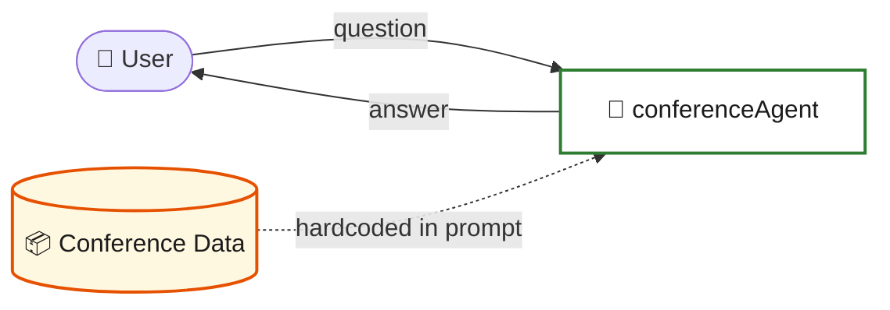
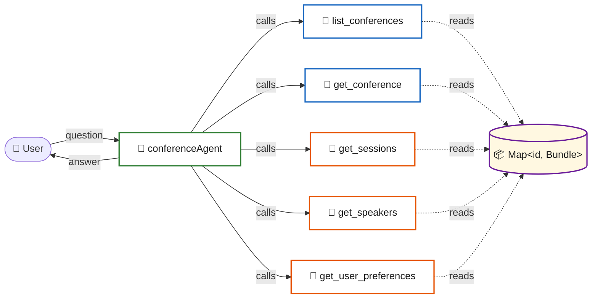
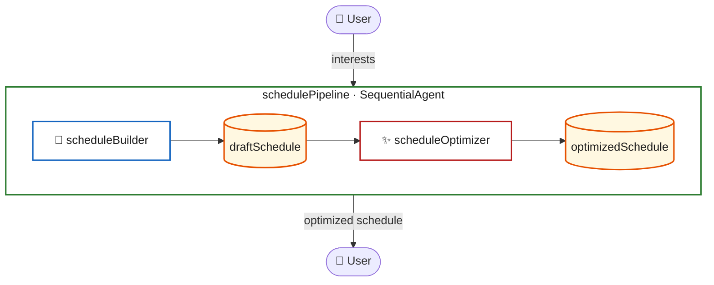
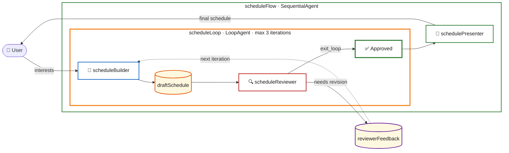
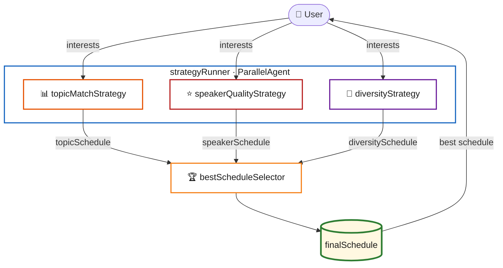

# 🛠️ Workshop Guide: Build a Conference Schedule Agent

Welcome to the ADK-JS workshop! 🎉 You'll build a Conference Schedule Agent for any **DevFest-style conference** — step by step, from a simple chatbot to a multi-agent system with parallel execution. 🚀

The codebase supports **multiple conferences out of the box**: data is keyed by conference id (e.g. `pisa-2026`), and the agents discover which conference the user cares about at runtime.

## 🗺️ Overview

```
Step 1: LlmAgent          -> Simple agent with hardcoded schedule
Step 2: FunctionTool       -> Extract data into tools
Step 3: SequentialAgent    -> Two-agent refinement pipeline
Step 4: LoopAgent          -> Iterative self-improvement with a critic
Step 5: ParallelAgent      -> Multi-strategy generation + selector
```

## 📁 Project Structure

Each step lives in its own folder under `src/`. You work through them in order, and each folder is self-contained:

```
src/
  01-intro/          -> Step 1
  02-tools/          -> Step 2
  03-sequential/     -> Step 3
  04-loop/           -> Step 4
  05-parallel/       -> Step 5
```

The `main` branch contains the starter code with TODOs for you to complete. The `final` branch contains the full solutions for reference. 💡

## ✅ Prerequisites

Make sure you've completed the setup from the [README](README.md):

- 📦 Node.js 24+, npm 10+, Git
- 🔑 Google AI API Key ([get one here](https://aistudio.google.com/apikey))
- 🧪 Run `./scripts/check-setup.sh` to verify

### 📥 Install dependencies

```bash
npm install
```

---

## 📦 Data Layout

Conference data is **keyed by conference id**. The root `data/conference.json` is a **list** of conferences; each conference has its own folder with per-conference speakers and schedule:

```
data/
  conference.json                  # [{ id, conference_name, venue, sponsors, ... }, ...]
  pisa-2026/
    speakers.json                  # Speaker[]
    schedule.json                  # ScheduleEntry[]
  <your-conference-id>/
    speakers.json
    schedule.json
```

The shared loader in [`src/common/conferenceData.ts`](src/common/conferenceData.ts) eagerly reads every folder at module load, validates with Zod, and exposes:

- `conferences` — array of all conference metadata (id, name, date, theme, venue, …)
- `getConferenceData(conferenceId)` — returns the full bundle `{ conference, speakers, schedule }` for a given id

**To add a new conference:**

1. Create `data/<your-id>/speakers.json` and `data/<your-id>/schedule.json`.
2. Append a new entry (with matching `id`) to `data/conference.json`.
3. Restart the dev server — the agent will immediately discover it via `list_conferences`.

---

## 🧩 Step 1: Your First Agent

**Concept:** `LlmAgent` — the building block of ADK

**Folder:** `src/01-intro/`

### 🏗️ What you'll build


```mermaid
graph LR
    User(["👤 User"])
    Agent["🤖 conferenceAgent"]
    Data[("📦 Conference Data")]

    User -- "question" --> Agent
    Agent -- "answer" --> User
    Data -. "hardcoded in prompt" .-> Agent

    style Agent fill:#ffffff,stroke:#2e7d32,stroke-width:2px,color:#1b1b1b
    style Data fill:#fff8e1,stroke:#e65100,stroke-width:2px,color:#1b1b1b
```

> A single `LlmAgent` with all conference data embedded directly in the system prompt. No tools, no composition — just one agent answering questions. 💬

### 🎓 What you'll learn

An `LlmAgent` wraps a large language model with a name, description, and instruction (system prompt). The instruction defines the agent's personality and knowledge. In this step, we use shared markdown utilities to inject a single conference's data into the agent's prompt.

The project includes a `src/common/` folder with reusable modules:

- **`conferenceData.ts`** — eagerly loads and validates every conference under `data/` using Zod, and exposes `conferences` and `getConferenceData(id)`
- **`toMarkdown.ts`** — converts each data type into well-structured markdown, ideal for LLM consumption

Since Step 1 has no tools, we simply pick a **default conference id** and render its bundle into the prompt.

### ✏️ Your task

Open `src/01-intro/agent.ts` and complete the TODOs:

1. Import `getConferenceData` from `"../common/conferenceData.js"`
2. Import `{ conferenceToMarkdown, speakersToMarkdown, scheduleToMarkdown }` from `"../common/toMarkdown.js"`
3. Pick a default conference id (e.g. `"pisa-2026"`) and destructure `{ conference, speakers, schedule }` from `getConferenceData(...)`
4. Use the conference name in the description/instruction (no hardcoded string), and render the three markdown helpers into the instruction

**Key code:** 👇

```typescript
import { LlmAgent } from "@google/adk";
import { getConferenceData } from "../common/conferenceData.js";
import { getModel } from "../common/models.js";
import {
  conferenceToMarkdown,
  scheduleToMarkdown,
  speakersToMarkdown,
} from "../common/toMarkdown.js";

const DEFAULT_CONFERENCE_ID = "pisa-2026";
const { conference, speakers, schedule } = getConferenceData(
  DEFAULT_CONFERENCE_ID,
);

export const rootAgent = new LlmAgent({
  name: "conferenceAgent",
  model: getModel(),
  description: `A helpful assistant for the ${conference.conference_name} conference. It answers questions about sessions, speakers, and helps attendees plan their day.`,
  instruction: `You are a friendly and enthusiastic conference assistant for ${conference.conference_name}.

${conferenceToMarkdown(conference)}

${scheduleToMarkdown(schedule)}

${speakersToMarkdown(speakers)}

## How you help attendees

- Answer questions about sessions, speakers, rooms, and timing
- Help attendees plan their day based on their interests
- Provide speaker bios and talk descriptions
- Give directions to the venue

Be enthusiastic about the conference and encourage exploration across rooms and topics!`,
});
```

### 🚀 Try it

```bash
npm run dev:01
```

This launches the ADK DevTools web UI. Open your browser and try:

- _"What AI sessions are available?"_ 🤖
- _"Tell me about Nicola Corti"_ 🎤
- _"Plan my day — I love Cloud and DevOps"_ 📅

### 🔍 Check the solution

Switch to the `final` branch and look at `src/01-intro/agent.ts`.

### 💭 Reflection

The agent works and the data stays in sync with the JSON source files automatically. But notice: **the whole conference** is baked into the prompt, and the prompt is tied to one specific conference. What if you want the agent to handle multiple conferences, or to look up data on demand? This motivates **Step 2**. ➡️

---

## 🔧 Step 2: Adding Tools

**Concept:** `FunctionTool` — give your agent superpowers 💪

**Folder:** `src/02-tools/`

### 🏗️ What you'll build


```mermaid
graph LR
    User(["👤 User"])
    Agent["🤖 conferenceAgent"]
    T0["🔧 list_conferences"]
    T1["🔧 get_conference"]
    T2["🔧 get_sessions"]
    T3["🔧 get_speakers"]
    T4["🔧 get_user_preferences"]
    Data[("📦 Map&lt;id, Bundle&gt;")]

    User -- "question" --> Agent
    Agent -- "answer" --> User
    Agent -- "calls" --> T0
    Agent -- "calls" --> T1
    Agent -- "calls" --> T2
    Agent -- "calls" --> T3
    Agent -- "calls" --> T4
    T0 -. "reads" .-> Data
    T1 -. "reads" .-> Data
    T2 -. "reads" .-> Data
    T3 -. "reads" .-> Data
    T4 -. "reads" .-> Data

    style Agent fill:#ffffff,stroke:#2e7d32,stroke-width:2px,color:#1b1b1b
    style T0 fill:#ffffff,stroke:#1565c0,stroke-width:2px,color:#1b1b1b
    style T1 fill:#ffffff,stroke:#1565c0,stroke-width:2px,color:#1b1b1b
    style T2 fill:#ffffff,stroke:#e65100,stroke-width:2px,color:#1b1b1b
    style T3 fill:#ffffff,stroke:#e65100,stroke-width:2px,color:#1b1b1b
    style T4 fill:#ffffff,stroke:#e65100,stroke-width:2px,color:#1b1b1b
    style Data fill:#fff8e1,stroke:#6a1b9a,stroke-width:2px,color:#1b1b1b
```

> The same agent, but now it fetches data on demand through **FunctionTools** instead of having everything in the prompt. Two of the tools (`list_conferences`, `get_conference`) let the agent discover which conference to work with; the other three operate on a specific `conferenceId`. The LLM decides which tools to call based on the user's question. 🧠

### 🎓 What you'll learn

Tools are functions that the LLM can call to retrieve data or perform actions. Instead of stuffing everything in the prompt, we define tools with typed parameters (using Zod schemas) and let the agent decide when to call them.

Because the codebase supports **multiple conferences**, every data tool takes a `conferenceId` parameter. Two additional tools (`list_conferences`, `get_conference`) let the agent discover which conference the user wants.

### ✏️ Your task

You'll find three files to work on:

**1. `src/02-tools/data/conferenceData.ts`** — Already provided! Re-exports `conferences` and `getConferenceData` from the shared loader.

**2. `src/02-tools/tools.ts`** — Create five FunctionTools:

```typescript
import { FunctionTool } from "@google/adk";
import { z } from "zod";
import { conferenceToMarkdown } from "../common/toMarkdown.js";
import { conferences, getConferenceData } from "./data/conferenceData.js";

const conferenceIdParam = z
  .string()
  .describe(
    "The conference id, e.g. 'pisa-2026'. Call list_conferences to discover available ids.",
  );

export const listConferences = new FunctionTool({
  name: "list_conferences",
  description:
    "List all available conferences with their id, name, start date and theme. Call this first when the user hasn't specified which conference they want.",
  parameters: z.object({}),
  execute: async () => {
    if (conferences.length === 0) {
      return "No conferences are configured.";
    }
    return conferences
      .map(
        (c) =>
          `${c.id} | ${c.conference_name} | ${c.start_time} | Theme: ${c.theme}`,
      )
      .join("\n");
  },
});

export const getConference = new FunctionTool({
  name: "get_conference",
  description:
    "Get full details for a conference: venue, directions, organizers and sponsors.",
  parameters: z.object({
    conferenceId: conferenceIdParam,
  }),
  execute: async ({ conferenceId }) => {
    const { conference } = getConferenceData(conferenceId);
    return conferenceToMarkdown(conference);
  },
});

export const getSessions = new FunctionTool({
  name: "get_sessions",
  description:
    "Get conference sessions, optionally filtered by speaker, room, or time slot.",
  parameters: z.object({
    conferenceId: conferenceIdParam,
    speaker: z
      .string()
      .optional()
      .describe("Filter by speaker name (partial match)"),
    room: z
      .string()
      .optional()
      .describe("Filter by room name (partial match)"),
    timeSlot: z
      .string()
      .optional()
      .describe(
        "Filter by time slot, e.g. '10:00' or 'morning' or 'afternoon'"
      ),
  }),
  execute: async ({
    conferenceId,
    speaker,
    room,
    timeSlot,
  }) => {
    const { schedule } = getConferenceData(conferenceId);
    let result = schedule;

    if (speaker) {
      result = result.filter((s) =>
        s.speaker.toLowerCase().includes(speaker.toLowerCase())
      );
    }

    if (room) {
      result = result.filter((s) =>
        s.room.toLowerCase().includes(room.toLowerCase())
      );
    }

    if (timeSlot) {
      const slot = timeSlot.toLowerCase();
      if (slot === "morning") {
        result = result.filter((s) => {
          const hour = parseInt(s.start_time.split("T")[1].split(":")[0]);
          return hour < 13;
        });
      } else if (slot === "afternoon") {
        result = result.filter((s) => {
          const hour = parseInt(s.start_time.split("T")[1].split(":")[0]);
          return hour >= 13;
        });
      } else {
        result = result.filter((s) => s.start_time.includes(timeSlot));
      }
    }

    if (result.length === 0) {
      return "No sessions found matching the given filters.";
    }

    return result
      .map(
        (s) =>
          `${s.start_time} - ${s.end_time} | ${s["talk title"]} by ${s.speaker} | ${s.room}`
      )
      .join("\n\n");
  },
});

export const getSpeakers = new FunctionTool({
  name: "get_speakers",
  description:
    "Get information about conference speakers, optionally filtered by name or heading.",
  parameters: z.object({
    conferenceId: conferenceIdParam,
    name: z
      .string()
      .optional()
      .describe("Filter by speaker name (partial match)"),
    heading: z
      .string()
      .optional()
      .describe("Filter by heading/role (partial match)"),
  }),
  execute: async ({
    conferenceId,
    name,
    heading,
  }) => {
    const { speakers } = getConferenceData(conferenceId);
    let result = speakers;

    if (name) {
      result = result.filter((s) =>
        s.name.toLowerCase().includes(name.toLowerCase())
      );
    }

    if (heading) {
      result = result.filter((s) =>
        s.heading.toLowerCase().includes(heading.toLowerCase())
      );
    }

    if (result.length === 0) {
      return "No speakers found matching the given filters.";
    }

    return result
      .map((s) => `${s.name} — ${s.heading}\n  ${s.bio}`)
      .join("\n\n");
  },
});

export const getUserPreferences = new FunctionTool({
  name: "get_user_preferences",
  description:
    "Record and return structured user preferences for schedule building. Call this when the user shares their interests.",
  parameters: z.object({
    conferenceId: conferenceIdParam,
    interests: z
      .array(z.string())
      .describe(
        "List of topics the user is interested in"
      ),
    mustSeeSpeakers: z
      .array(z.string())
      .optional()
      .describe("Speakers the user specifically wants to see"),
  }),
  execute: async ({
    conferenceId,
    interests,
    mustSeeSpeakers,
  }) => {
    const { schedule } = getConferenceData(conferenceId);
    const rooms = [...new Set(schedule.map((s) => s.room))];
    return JSON.stringify(
      {
        conferenceId,
        interests,
        mustSeeSpeakers: mustSeeSpeakers ?? [],
        availableRooms: rooms,
      },
      null,
      2
    );
  },
});
```

**3. `src/02-tools/agent.ts`** — Slim down the instruction and register all five tools:

```typescript
import { LlmAgent } from "@google/adk";
import { getModel } from "../common/models.js";
import {
  getConference,
  getSessions,
  getSpeakers,
  getUserPreferences,
  listConferences,
} from "./tools.js";

export const rootAgent = new LlmAgent({
  name: "conferenceAgent",
  model: getModel(),
  description:
    "A helpful assistant for DevFest-style conferences. It answers questions about sessions, speakers, and helps attendees plan their day.",
  instruction: `You are a friendly and enthusiastic conference assistant for DevFest-style conferences.

Use your tools to look up session and speaker information. Do NOT make up data — always use the tools.

Conference discovery:
- If the user hasn't told you which conference they mean, call list_conferences first and ask them to pick one.
- Once a conference is chosen, pass its conferenceId to every other tool (get_conference, get_sessions, get_speakers, get_user_preferences).
- Call get_conference when the user asks about the venue, directions, organizers or sponsors.

When a user shares their interests, use get_user_preferences to record them, then use get_sessions to find matching sessions.

Help users:
- Find sessions by title, speaker, or time
- Learn about speakers and their expertise
- Plan their conference day avoiding time conflicts
- Get recommendations based on their interests

Be enthusiastic about the conference and encourage exploration across rooms and topics!`,
  tools: [listConferences, getConference, getSessions, getSpeakers, getUserPreferences],
});
```

### 🚀 Try it

```bash
npm run dev:02
```

Open the **trace view** in DevTools — you'll see the agent calling tools (starting with `list_conferences` when needed) instead of relying on hardcoded data. 🔎

- _"What conferences do you know about?"_ 🗂️
- _"For DevFest Pisa 2026, what AI sessions are available?"_ 🎯
- _"Who speaks at Pisa 2026 and works at Google?"_ 🏢
- _"I'm going to Pisa 2026 and I'm interested in AI and Cloud"_ ☁️

### 🔍 Check the solution

Switch to the `final` branch and look at `src/02-tools/`.

### 💭 Reflection

Now data is separated from logic, but the agent does everything in one shot. For complex tasks like schedule building, it would be better to have **specialized agents** working together. That's **Step 3**. ➡️

---

## ⛓️ Step 3: Sequential Flow

**Concept:** `SequentialAgent` — a pipeline of agents

**Folder:** `src/03-sequential/`

### 🏗️ What you'll build


```mermaid
graph TB
    User(["👤 User"])

    User -- "interests" --> Pipeline

    subgraph Pipeline["schedulePipeline · SequentialAgent"]
        direction LR
        Builder["🔨 scheduleBuilder"] --> State1[("draftSchedule")] --> Optimizer["✨ scheduleOptimizer"] --> State2[("optimizedSchedule")]
    end

    Pipeline -- "optimized schedule" --> Result(["👤 User"])

    style Pipeline fill:#ffffff,stroke:#2e7d32,stroke-width:2px,color:#1b1b1b
    style Builder fill:#ffffff,stroke:#1565c0,stroke-width:2px,color:#1b1b1b
    style Optimizer fill:#ffffff,stroke:#b71c1c,stroke-width:2px,color:#1b1b1b
    style State1 fill:#fff8e1,stroke:#e65100,stroke-width:2px,color:#1b1b1b
    style State2 fill:#fff8e1,stroke:#e65100,stroke-width:2px,color:#1b1b1b
```

> Two specialized agents in a pipeline. The **scheduleBuilder** creates a draft and saves it to shared state via `outputKey`. The **scheduleOptimizer** reads it via `{{draftSchedule}}` and produces an improved version. ✨

### 🎓 What you'll learn

A `SequentialAgent` executes sub-agents in a fixed order. Each agent focuses on one job and stores its output in shared state using `outputKey`. The next agent reads that state via `{{templateVariables}}` in its instruction.

### ✏️ Your task

**1. `src/03-sequential/agents/scheduleBuilder.ts`** — Builds an initial schedule:

```typescript
import { LlmAgent } from "@google/adk";
import { getModel } from "../../common/models.js";
import {
  getSessions,
  getSpeakers,
  getUserPreferences,
  listConferences,
} from "../tools.js";

export const scheduleBuilder = new LlmAgent({
  name: "scheduleBuilder",
  model: getModel(),
  description:
    "Builds a personalized conference schedule based on user preferences.",
  instruction: `You are a schedule builder for DevFest-style conferences.

Your job is to create a personalized day schedule for the attendee.

Steps:
1. If the user hasn't chosen a conference, call list_conferences and ask them to pick one. Use the chosen conferenceId in every subsequent tool call.
2. Use get_user_preferences to capture what the user is interested in
3. Use get_sessions to find sessions matching their interests
4. Use get_speakers to provide context about the speakers
5. Build a complete day schedule

Schedule format:
- Pick one session per time slot across rooms
- Include morning and afternoon sessions
- Leave the lunch break free

Rules:
- No time conflicts (only one session per time slot)
- Match the user's stated interests
- Include talk title, speaker, room, start and end time for each slot`,
  tools: [listConferences, getSessions, getSpeakers, getUserPreferences],
  outputKey: "draftSchedule",
});
```

**2. `src/03-sequential/agents/scheduleOptimizer.ts`** — Refines the schedule:

```typescript
import { LlmAgent } from "@google/adk";
import { getModel } from "../../common/models.js";
import { getSessions } from "../tools.js";

export const scheduleOptimizer = new LlmAgent({
  name: "scheduleOptimizer",
  model: getModel(),
  description:
    "Reviews and optimizes a draft conference schedule for quality and logistics.",
  instruction: `You are a schedule optimizer for DevFest-style conferences.

Review this draft schedule and improve it:
{{draftSchedule}}

Check for and fix these issues:
1. **Time conflicts**: Ensure no overlapping sessions
2. **Breaks**: Verify the lunch break is free, suggest a coffee break if possible
3. **Room logistics**: Flag if consecutive sessions are in distant rooms
4. **Difficulty progression**: Suggest starting with easier sessions and progressing to harder ones
5. **Alternatives**: For each time slot, suggest one alternative session the user might enjoy

When calling get_sessions, reuse the same conferenceId that appears in the draft schedule above.

Output the optimized schedule with:
- The final schedule with any improvements
- A brief explanation of changes made
- Alternative sessions for each slot`,
  tools: [getSessions],
  outputKey: "optimizedSchedule",
});
```

**3. `src/03-sequential/agent.ts`** — Compose them:

```typescript
import { SequentialAgent } from "@google/adk";
import { scheduleBuilder } from "./agents/scheduleBuilder.js";
import { scheduleOptimizer } from "./agents/scheduleOptimizer.js";

export const rootAgent = new SequentialAgent({
  name: "schedulePipeline",
  description:
    "Builds a personalized conference schedule, then optimizes it for quality and logistics.",
  subAgents: [scheduleBuilder, scheduleOptimizer],
});
```

### 🚀 Try it

```bash
npm run dev:03
```

- _"Which conferences are available?"_ 🗂️
- _"Build me a schedule for Pisa 2026. I love AI and DevOps."_ 🗓️

Watch the trace: `scheduleBuilder` runs first (calling `list_conferences` if the user hasn't named one), then `scheduleOptimizer` refines the result. 👀

### 🔍 Check the solution

Switch to the `final` branch and look at `src/03-sequential/`.

### 💭 Reflection

The pipeline works in one pass. But what if the optimizer finds issues the builder should fix? Currently there's no feedback loop. 🔄 **Step 4** introduces iteration. ➡️

---

## 🔄 Step 4: Loop Flow

**Concept:** `LoopAgent` — iterative refinement

**Folder:** `src/04-loop/`

### 🏗️ What you'll build


```mermaid
graph LR
    User(["👤 User"])

    subgraph Flow["scheduleFlow · SequentialAgent"]
        direction LR
        subgraph Loop["scheduleLoop · LoopAgent · max 3 iterations"]
            Builder["🔨 scheduleBuilder"]
            DraftState[("draftSchedule")]
            Reviewer["🔍 scheduleReviewer"]
            Approved["✅ Approved"]

            Builder --> DraftState --> Reviewer
            Reviewer -- "exit_loop" --> Approved
        end

        Presenter["📣 schedulePresenter"]
        Approved --> Presenter
    end

    FeedbackState[("reviewerFeedback")]
    Reviewer -- "needs revision" --> FeedbackState
    FeedbackState -. "next iteration" .-> Builder

    User -- "interests" --> Builder
    Presenter -- "final schedule" --> User

    style Flow fill:#ffffff,stroke:#2e7d32,stroke-width:2px,color:#1b1b1b
    style Loop fill:#ffffff,stroke:#f57f17,stroke-width:3px,color:#1b1b1b
    style Builder fill:#ffffff,stroke:#1565c0,stroke-width:2px,color:#1b1b1b
    style Reviewer fill:#ffffff,stroke:#b71c1c,stroke-width:2px,color:#1b1b1b
    style Presenter fill:#ffffff,stroke:#2e7d32,stroke-width:2px,color:#1b1b1b
    style DraftState fill:#fff8e1,stroke:#e65100,stroke-width:2px,color:#1b1b1b
    style FeedbackState fill:#fff8e1,stroke:#6a1b9a,stroke-width:2px,color:#1b1b1b
    style Approved fill:#ffffff,stroke:#2e7d32,stroke-width:3px,color:#1b1b1b
```

> The **generator/critic pattern**: the builder creates a schedule, the reviewer evaluates it against quality criteria. If it passes, `exit_loop` is called (sets `escalate = true`). If not, feedback flows back and the builder revises. Repeats up to 3 times. 🎯
>
> Once the loop exits, a **schedulePresenter** renders the approved `{{draftSchedule}}` as the final message — so the attendee actually sees the schedule, not just the reviewer's "approved" note. 📣

### 🎓 What you'll learn

A `LoopAgent` repeats its sub-agents until a condition is met (or max iterations is reached). This enables the **generator/critic pattern**: one agent builds, another reviews, and the loop continues until the critic is satisfied and calls `escalate` to exit. 🏆

### ✏️ Your task

**1. `src/04-loop/agents/scheduleBuilder.ts`** — Update to be revision-aware:

```typescript
import { LlmAgent } from "@google/adk";
import { getModel } from "../../common/models.js";
import {
  getSessions,
  getSpeakers,
  getUserPreferences,
  listConferences,
} from "../tools.js";

export const scheduleBuilder = new LlmAgent({
  name: "scheduleBuilder",
  model: getModel(),
  description:
    "Builds or revises a personalized conference schedule based on user preferences and reviewer feedback.",
  instruction: `You are a schedule builder for DevFest-style conferences.

Your job is to create or revise a personalized day schedule for the attendee.

PREVIOUS REVIEWER FEEDBACK (if any):
{{reviewerFeedback:}}

If there is reviewer feedback above, incorporate it to improve the schedule.
If there is no feedback yet, build a fresh schedule from the user's preferences.

Steps:
1. If the user hasn't chosen a conference, call list_conferences and ask them to pick one. Use the chosen conferenceId in every subsequent tool call.
2. Use get_user_preferences to capture what the user is interested in
3. Use get_sessions to find sessions matching their interests
4. Use get_speakers to provide context about the speakers
5. Build a complete day schedule

Schedule format:
- Pick one session per time slot across rooms
- Include morning and afternoon sessions
- Leave the lunch break free

Rules:
- No time conflicts (only one session per time slot)
- Match the user's stated interests
- Include talk title, speaker, room, start and end time for each slot`,
  tools: [listConferences, getSessions, getSpeakers, getUserPreferences],
  outputKey: "draftSchedule",
});
```

**2. `src/04-loop/agents/scheduleReviewer.ts`** — The critic agent with an exit tool:

```typescript
import { LlmAgent, FunctionTool } from "@google/adk";
import { z } from "zod";
import { getModel } from "../../common/models.js";

const exitLoop = new FunctionTool({
  name: "exit_loop",
  description:
    "Call this ONLY when the schedule meets ALL quality criteria. This will approve the schedule and end the review loop.",
  parameters: z.object({}),
  execute: async (_, context) => {
    context!.actions.escalate = true;
    return { status: "approved", message: "Schedule meets all quality criteria." };
  },
});

export const scheduleReviewer = new LlmAgent({
  name: "scheduleReviewer",
  model: getModel(),
  description:
    "Reviews a schedule against quality criteria and either approves it or provides improvement feedback.",
  instruction: `You are a schedule reviewer for DevFest-style conferences.

Review this schedule:
{{draftSchedule}}

Evaluate against these criteria:
1. **No time conflicts** — Only one session per time slot
2. **Preference match** — Sessions align with the user's stated interests
3. **Topic balance** — Not all sessions from a single topic area (aim for variety)
4. **Breaks included** — Lunch break is free
5. **Variety** — Mix of different topics and speakers

DECISION:
- If ALL criteria pass: Call the exit_loop tool to approve the schedule
- If ANY criteria fail: Provide specific, actionable feedback explaining what needs to change

When providing feedback, be specific. For example:
- "The morning slots are both in the same room — consider varying rooms"
- "All sessions are from the same speaker — add variety"`,
  tools: [exitLoop],
  outputKey: "reviewerFeedback",
});
```

**3. `src/04-loop/agents/schedulePresenter.ts`** — Outputs the approved schedule as the final message so the user actually sees it (the reviewer's last text is just an "approved" note):

```typescript
import { LlmAgent } from "@google/adk";
import { getModel } from "../../common/models.js";

export const schedulePresenter = new LlmAgent({
  name: "schedulePresenter",
  model: getModel(),
  description:
    "Presents the approved conference schedule to the user as the final answer.",
  instruction: `You are the final voice of the schedule flow.

The reviewer has just approved this schedule:

{{draftSchedule}}

Your job is to present it back to the attendee as the last message of the conversation.

Rules:
- Reproduce the full schedule exactly — do not drop or rename sessions
- Keep the original time slots, talk titles, speakers and rooms
- Do not call any tools
- Do not add critique, reviewer notes or feedback
- Be friendly and enthusiastic; a short closing line is fine`,
});
```

**4. `src/04-loop/agent.ts`** — Wire the loop and the presenter into a sequential flow:

```typescript
import { LoopAgent, SequentialAgent } from "@google/adk";
import { scheduleBuilder } from "./agents/scheduleBuilder.js";
import { schedulePresenter } from "./agents/schedulePresenter.js";
import { scheduleReviewer } from "./agents/scheduleReviewer.js";

const scheduleLoop = new LoopAgent({
  name: "scheduleLoop",
  description:
    "Iteratively builds and reviews a conference schedule until quality criteria are met.",
  subAgents: [
    new SequentialAgent({
      name: "buildAndReview",
      subAgents: [scheduleBuilder, scheduleReviewer],
    }),
  ],
  maxIterations: 3,
});

export const rootAgent = new SequentialAgent({
  name: "scheduleFlow",
  description:
    "Iteratively builds and reviews a conference schedule, then presents the approved version to the user.",
  subAgents: [scheduleLoop, schedulePresenter],
});
```

### 🚀 Try it

```bash
npm run dev:04
```

- _"Build me a schedule for Pisa 2026. I'm interested in everything but especially AI."_ 🤖

Watch the trace show multiple iterations — the schedule improves each round until the reviewer is satisfied. 📈

### 🔍 Check the solution

Switch to the `final` branch and look at `src/04-loop/`.

### 💭 Reflection

The loop produces a high-quality single schedule. But what if you want to explore **different strategies**? Running them one by one would be slow. 🐢 **Step 5** runs them in parallel! ⚡ ➡️

---

## ⚡ Step 5: Parallel Flow

**Concept:** `ParallelAgent` — concurrent execution

**Folder:** `src/05-parallel/`

### 🏗️ What you'll build


```mermaid
graph TB
    User(["👤 User"])

    subgraph Parallel["strategyRunner · ParallelAgent"]
        direction LR
        S1["📊 topicMatchStrategy"]
        S2["⭐ speakerQualityStrategy"]
        S3["🌈 diversityStrategy"]
    end

    Selector["🏆 bestScheduleSelector"]
    FinalState[("finalSchedule")]

    User -- "interests" --> S1
    User -- "interests" --> S2
    User -- "interests" --> S3
    S1 -- "topicSchedule" --> Selector
    S2 -- "speakerSchedule" --> Selector
    S3 -- "diversitySchedule" --> Selector
    Selector --> FinalState
    FinalState -- "best schedule" --> User

    style Parallel fill:#ffffff,stroke:#1565c0,stroke-width:2px,color:#1b1b1b
    style S1 fill:#ffffff,stroke:#e65100,stroke-width:2px,color:#1b1b1b
    style S2 fill:#ffffff,stroke:#b71c1c,stroke-width:2px,color:#1b1b1b
    style S3 fill:#ffffff,stroke:#6a1b9a,stroke-width:2px,color:#1b1b1b
    style Selector fill:#ffffff,stroke:#f57f17,stroke-width:2px,color:#1b1b1b
    style FinalState fill:#fff8e1,stroke:#2e7d32,stroke-width:3px,color:#1b1b1b
```

> Three strategy agents run **simultaneously**, each optimizing for a different goal (topic relevance, speaker quality, diversity). Their outputs are stored in shared state. Then a **selector agent** reads all three and picks the best — or creates a hybrid combining the strongest picks from each. 🏆

### 🎓 What you'll learn

A `ParallelAgent` runs multiple sub-agents simultaneously. Think of it as asking three friends to each plan your day with different priorities, then picking the best plan. 🤝

### ✏️ Your task

Create three strategy agents, a selector, and compose them:

**1. `src/05-parallel/agents/topicMatchStrategy.ts`** — Optimize for topic relevance:

```typescript
import { LlmAgent } from "@google/adk";
import { getModel } from "../../common/models.js";
import {
  getSessions,
  getSpeakers,
  getUserPreferences,
  listConferences,
} from "../tools.js";

export const topicMatchStrategy = new LlmAgent({
  name: "topicMatchStrategy",
  model: getModel(),
  description:
    "Builds a schedule that maximizes topic relevance to user interests.",
  instruction: `You are a schedule strategist for DevFest-style conferences.
Your optimization goal: MAXIMIZE TOPIC RELEVANCE.

1. If the user hasn't chosen a conference, call list_conferences and ask them to pick one. Use the chosen conferenceId in every subsequent tool call.
2. Use get_user_preferences to understand the user's interests
3. Use get_sessions to find ALL sessions matching the user's preferred topics
4. Build a full day schedule that prioritizes sessions matching their interests

Strategy:
- Fill every slot with the most relevant session based on talk title and speaker expertise
- If multiple sessions match in a time slot, pick the one closest to their interests
- Only use less relevant sessions if no matching session is available
- Match the user's skill level when possible

For each session include: title, speaker, room, start and end time.
End with a brief explanation of why this schedule maximizes topic relevance.`,
  tools: [listConferences, getSessions, getSpeakers, getUserPreferences],
  outputKey: "topicSchedule",
});
```

**2. `src/05-parallel/agents/speakerQualityStrategy.ts`** — Optimize for top speakers.

```typescript
import { LlmAgent } from "@google/adk";
import { getModel } from "../../common/models.js";
import {
  getSessions,
  getSpeakers,
  getUserPreferences,
  listConferences,
} from "../tools.js";

export const speakerQualityStrategy = new LlmAgent({
  name: "speakerQualityStrategy",
  model: getModel(),
  description:
    "Builds a schedule that prioritizes the most renowned speakers and expert-level content.",
  instruction: `You are a schedule strategist for DevFest-style conferences.
Your optimization goal: MAXIMIZE SPEAKER QUALITY.

1. If the user hasn't chosen a conference, call list_conferences and ask them to pick one. Use the chosen conferenceId in every subsequent tool call.
2. Use get_user_preferences to understand the user's interests (as secondary criteria)
3. Use get_speakers to learn about ALL speakers
4. Use get_sessions to find sessions by the top speakers
5. Build a full day schedule that prioritizes the best speakers

Strategy:
- Prioritize keynote speakers and recognized experts based on their heading/bio
- Favor sessions by speakers with the most relevant expertise
- Use topic relevance only as a tiebreaker between equally qualified speakers

For each session include: title, speaker, room, start and end time.
End with a brief explanation of why this schedule maximizes speaker quality.`,
  tools: [listConferences, getSessions, getSpeakers, getUserPreferences],
  outputKey: "speakerSchedule",
});
```

**3. `src/05-parallel/agents/diversityStrategy.ts`** — Optimize for breadth and variety.

```typescript
import { LlmAgent } from "@google/adk";
import { getModel } from "../../common/models.js";
import {
  getSessions,
  getSpeakers,
  getUserPreferences,
  listConferences,
} from "../tools.js";

export const diversityStrategy = new LlmAgent({
  name: "diversityStrategy",
  model: getModel(),
  description:
    "Builds a schedule that maximizes variety across rooms, topics, and speakers.",
  instruction: `You are a schedule strategist for DevFest-style conferences.
Your optimization goal: MAXIMIZE DIVERSITY AND BREADTH.

1. If the user hasn't chosen a conference, call list_conferences and ask them to pick one. Use the chosen conferenceId in every subsequent tool call.
2. Use get_user_preferences to understand the user's interests (as light guidance)
3. Use get_sessions to explore ALL available sessions
4. Build a full day schedule that maximizes variety

Strategy:
- Pick sessions from as many DIFFERENT rooms and topics as possible
- Mix session types and topics for variety
- Avoid scheduling the same speaker twice
- Expose the user to topics outside their comfort zone
- Balance between the user's interests and new discoveries

For each session include: title, speaker, room, start and end time.
End with a brief explanation of why this schedule maximizes diversity.`,
  tools: [listConferences, getSessions, getSpeakers, getUserPreferences],
  outputKey: "diversitySchedule",
});
```

**4. `src/05-parallel/agents/bestScheduleSelector.ts`** — Compare and pick the best:

```typescript
import { LlmAgent } from "@google/adk";
import { getModel } from "../../common/models.js";

export const bestScheduleSelector = new LlmAgent({
  name: "bestScheduleSelector",
  model: getModel(),
  description:
    "Compares multiple schedule proposals and selects or synthesizes the best one.",
  instruction: `You are a schedule advisor for DevFest-style conferences.

Three different strategies have produced schedule proposals:

**Strategy 1 — Topic Match (maximizes relevance to your interests):**
{{topicSchedule}}

**Strategy 2 — Speaker Quality (prioritizes the best speakers):**
{{speakerSchedule}}

**Strategy 3 — Diversity (maximizes variety across rooms and topics):**
{{diversitySchedule}}

Your job:
1. Compare all three schedules
2. Evaluate each against the user's stated preferences
3. Select the BEST schedule, or create a HYBRID that takes the best picks from each
4. Explain the trade-offs clearly

Output format:
- Present the recommended final schedule
- For each session choice, note which strategy it came from (if creating a hybrid)
- Explain WHY this is the best option for this particular user
- Mention what the user would miss and why the trade-off is worth it`,
  outputKey: "finalSchedule",
});
```

**5. `src/05-parallel/agent.ts`** — Compose everything:

```typescript
import { ParallelAgent, SequentialAgent } from "@google/adk";
import { bestScheduleSelector } from "./agents/bestScheduleSelector.js";
import { diversityStrategy } from "./agents/diversityStrategy.js";
import { speakerQualityStrategy } from "./agents/speakerQualityStrategy.js";
import { topicMatchStrategy } from "./agents/topicMatchStrategy.js";

const strategyRunner = new ParallelAgent({
  name: "strategyRunner",
  description: "Runs three schedule optimization strategies in parallel.",
  subAgents: [topicMatchStrategy, speakerQualityStrategy, diversityStrategy],
});

export const rootAgent = new SequentialAgent({
  name: "scheduleGenerator",
  description:
    "Generates three schedule strategies in parallel, then selects the best one.",
  subAgents: [strategyRunner, bestScheduleSelector],
});
```

### 🚀 Try it

```bash
npm run dev:05
```

- _"Build me a schedule for Pisa 2026. I'm a backend developer interested in Cloud and DevOps but also curious about AI."_ 💻

Watch the trace: three strategy agents light up simultaneously (each calling `list_conferences` in parallel if needed), then the selector picks the best. 🎆

### 🔍 Check the solution

Switch to the `final` branch and look at `src/05-parallel/`.

---

## 🎉 Recap

| Step | Concept           | What you built                                      |
| ---- | ----------------- | --------------------------------------------------- |
| 1 🧩 | `LlmAgent`        | Single agent with hardcoded conference data         |
| 2 🔧 | `FunctionTool`    | Agent with tools for dynamic data retrieval         |
| 3 ⛓️ | `SequentialAgent` | Builder -> Optimizer pipeline                       |
| 4 🔄 | `LoopAgent`       | Builder <-> Reviewer iterative refinement           |
| 5 ⚡ | `ParallelAgent`   | 3 strategies in parallel -> Selector picks best     |

You've gone from a simple chatbot to a sophisticated multi-agent system! 🚀 Each ADK concept builds on the previous, giving you a toolkit for building real-world AI agent applications. 🎊

## 🔮 Next Steps

- 🆕 Add your own conference by dropping JSON into `data/<your-id>/` (see [Data Layout](#-data-layout))
- 📖 Explore the [ADK documentation](https://google.github.io/adk-docs/)
- 🛠️ Try adding your own tools (e.g., fetch real conference data from an API)
- 🧪 Experiment with different agent compositions
- 🐳 Deploy your agent using Docker and Cloud Run
